# Guide des Fichiers 3D (STL) – Trieuse Automatique Arduino

Ce document présente l'explication et le rôle de chaque composant imprimable en 3D (`.stl`) pour la trieuse automatique de bonbons (Skittles/M&M's) basée sur Arduino.

---

## 1. Composants Mécaniques et Rotatifs

* **`main-disc.stl`**
  * **Description :** Disque rotatif principal de tri.
  * **Rôle :** Il récupère les bonbons un par un depuis l'entonnoir/réservoir, les déplace sous le capteur de couleur pour l'analyse, puis les achemine vers la rampe de distribution.

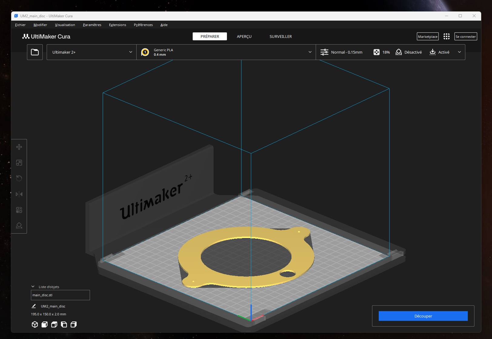

* **`turning-disc-servo.stl`**
  * **Description :** Pièce de liaison entre l'axe du servomoteur et le disque principal.
  * **Rôle :** Permet de fixer fermement le servomoteur au disque rotatif afin de transmettre le mouvement de rotation pas à pas.

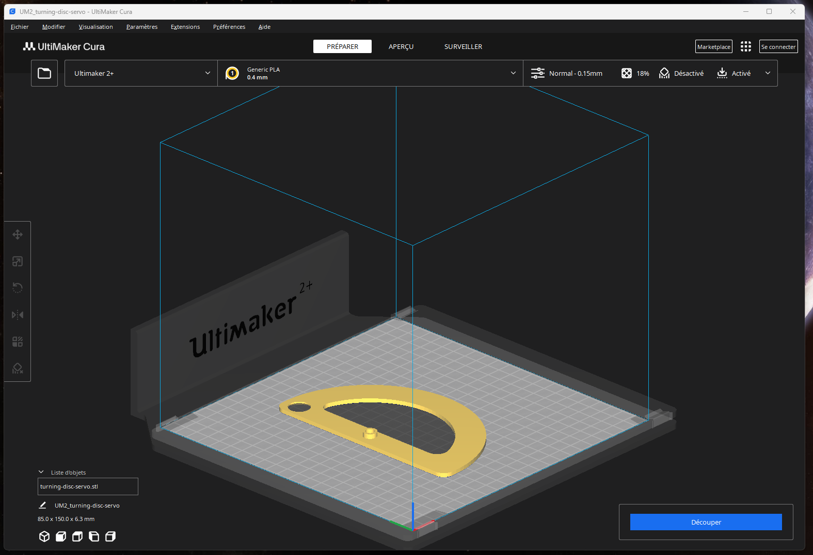

---

## 2. Alimentation et Entonnoir (Feeder)

* **`feeder-main.stl`**
  * **Description :** Corps principal du trémie / réservoir de bonbons.
  * **Rôle :** Sert de contenant pour verser les Skittles ou M&M's au départ et les guider de manière fluide vers le disque rotatif.

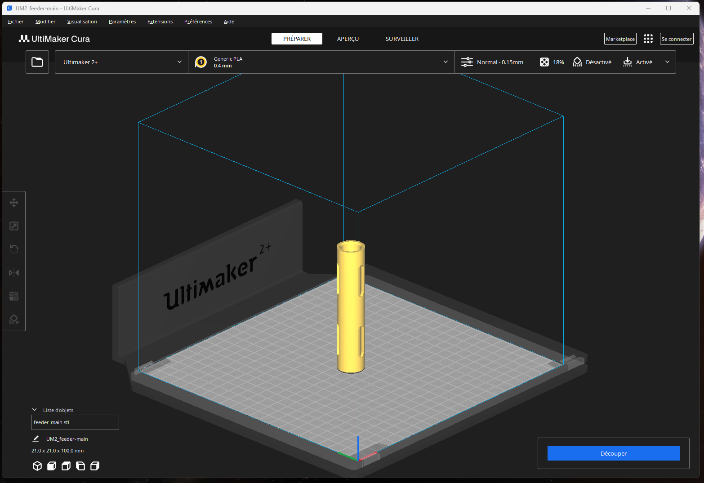

* **`feeder-clamp.stl`**
  * **Description :** Pince / Fixation du réservoir.
  * **Rôle :** Assure le maintien rigide du réservoir sur la structure pour éviter les vibrations ou les déplacements indésirables lors de la distribution.

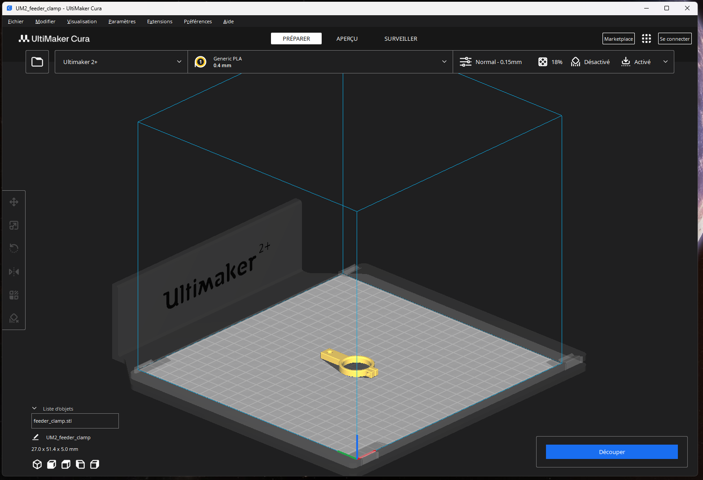

* **`support-feeder.stl`**
  * **Description :** Support vertical de l'entonnoir.
  * **Rôle :** Maintient l'entonnoir à la hauteur optimale par rapport au disque de sélection.

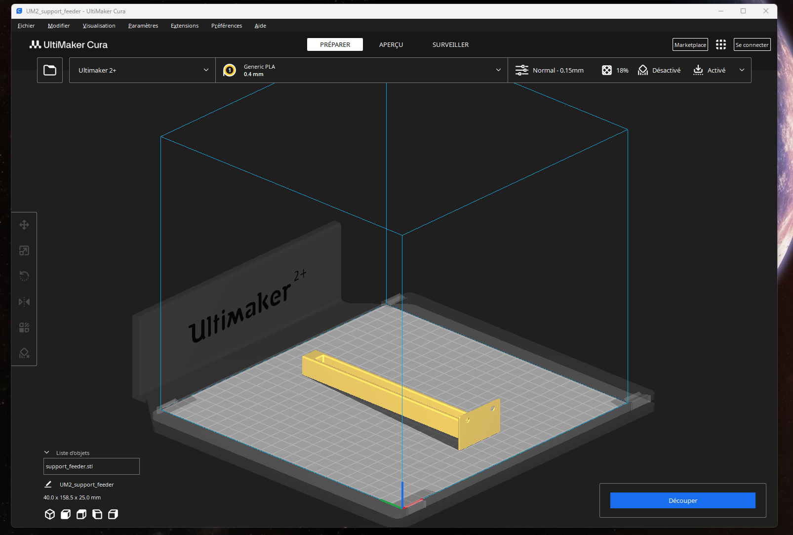

---

## 3. Système d'Éjection et Raccordement (Rampe)

* **`ramp-main.stl`**
  * **Description :** Rampe d'évacuation principale.
  * **Rôle :** Canalise le bonbon libéré vers le gobelet ou le réceptacle correspondant après la détection de sa couleur.

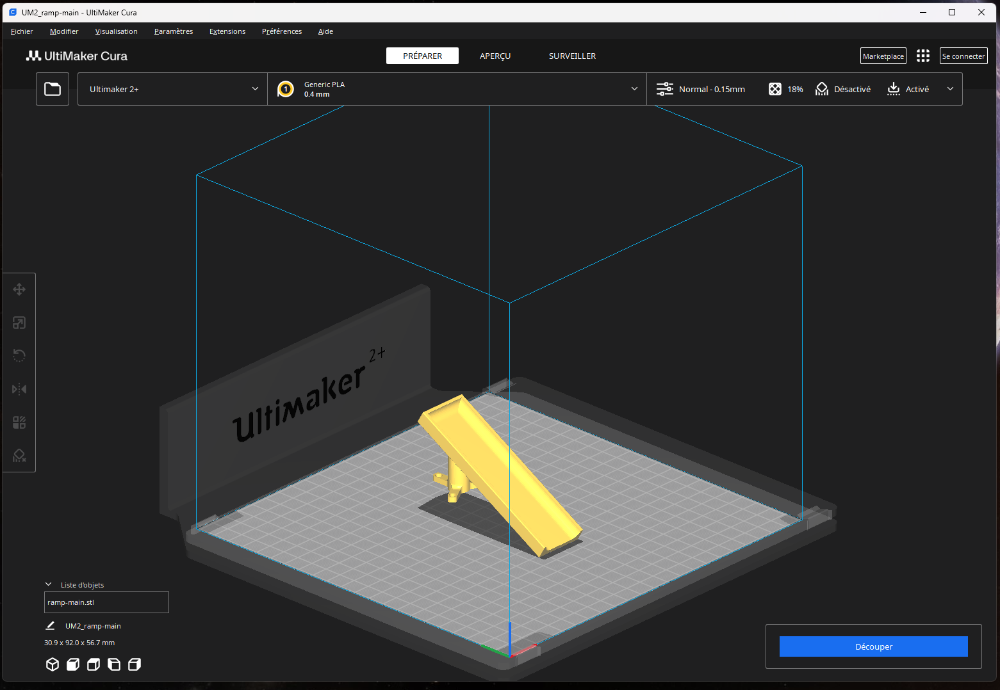

* **`ramp-adapt.stl`**
  * **Description :** Adaptateur / Guide pour la rampe.
  * **Rôle :** S'intercale entre le mécanisme de tri et la rampe pour ajuster l'angle de chute et éviter que les bonbons ne se coincent.

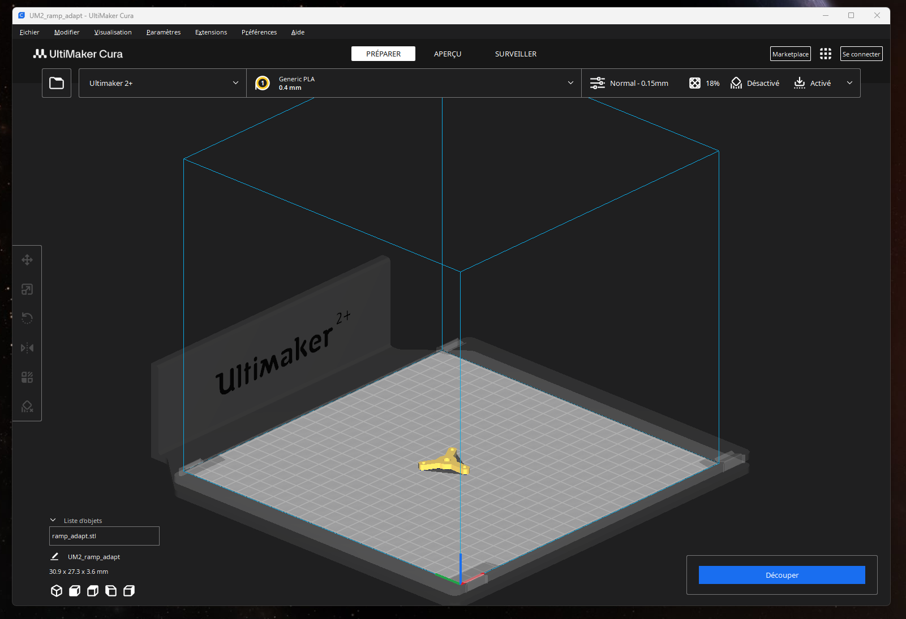

---

## 4. Supports et Fixations des Capteurs & Actuateurs

* **`support-sensor.stl` & `support-main-sensor.stl`**
  * **Description :** Fixations du capteur de couleur (ex: RGB TCS230 / TCS3200).
  * **Rôle :** Positionnent le capteur à une distance constante et précise au-dessus du bonbon pour garantir une lecture exacte des valeurs de couleur sans parasite lumineux extérieur.

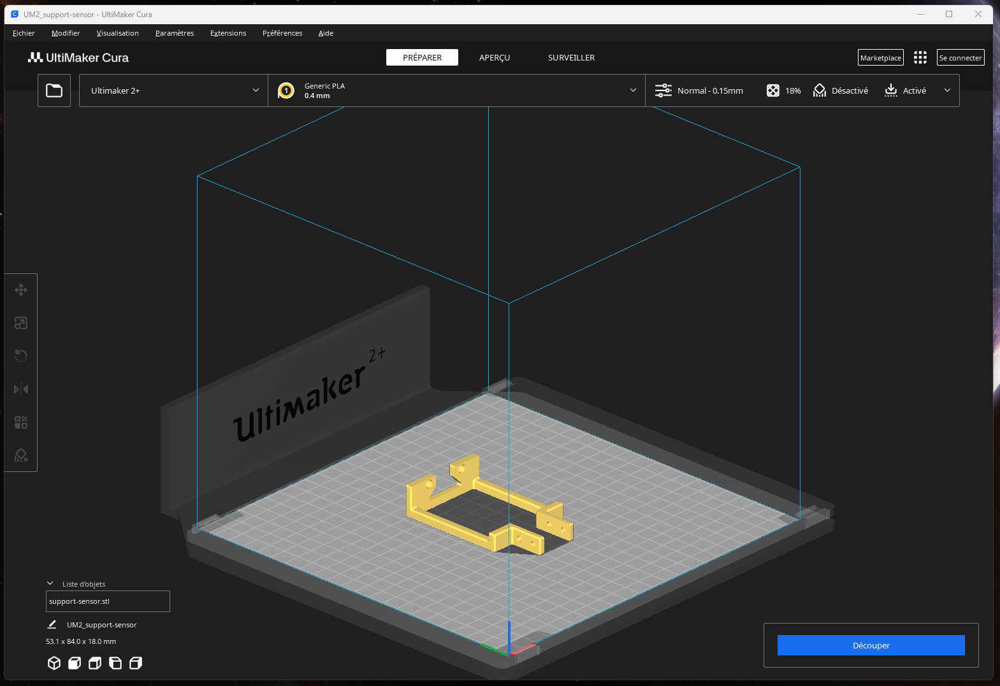
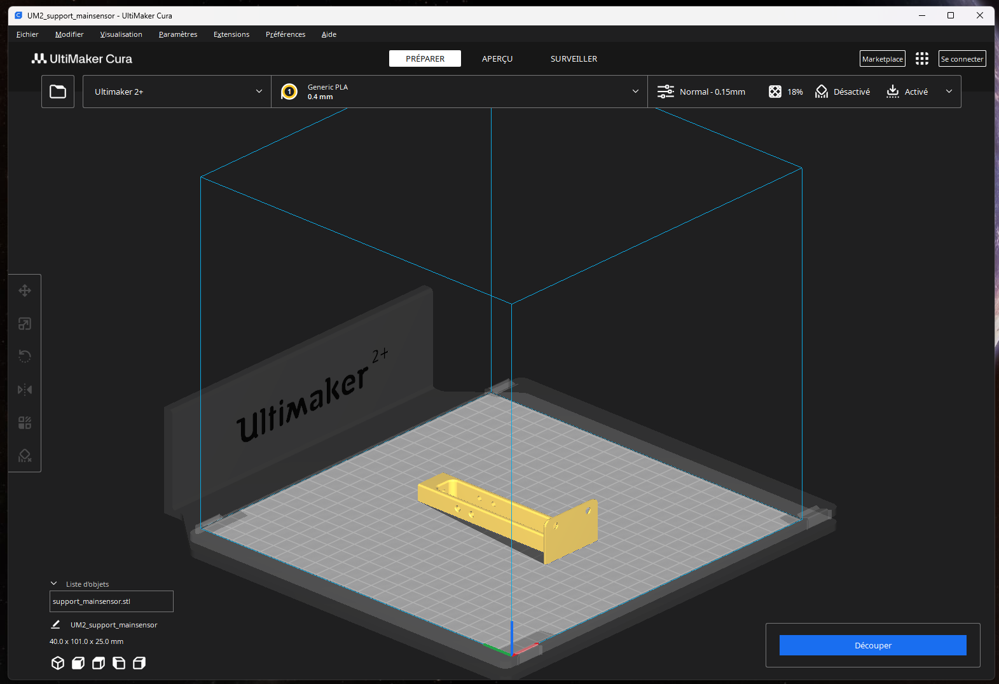

* **`support-servo.stl` & `support-main-servo.stl`**
  * **Description :** Supports de maintien pour le(s) servomoteur(s).
  * **Rôle :** Bloquent la structure des servomoteurs (servomoteur de rotation et servomoteur d'orientation de la rampe).

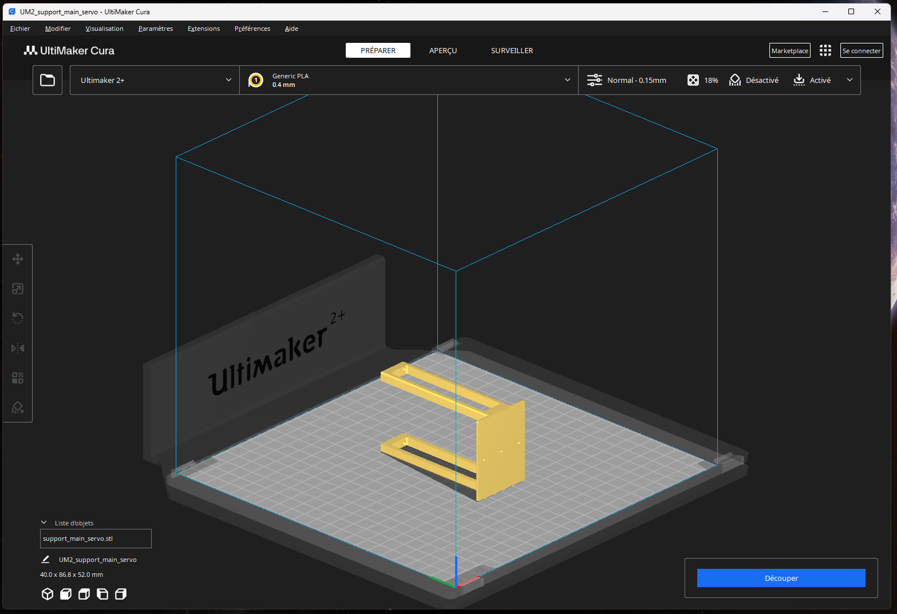

* **`support-main.stl`**
  * **Description :** Châssis / Support central principal.
  * **Rôle :** Pièce structurelle centrale sur laquelle viennent se fixer les différents modules de l'appareil.

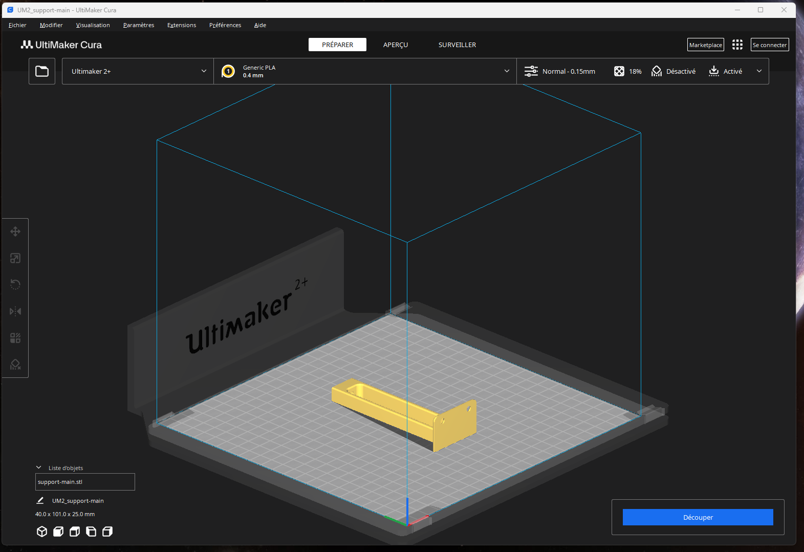
---

## 5. Socle et Fichiers Regroupés

* **`base-for-skittles.stl`**
  * **Description :** Embase de maintien au sol / plateau de réception.
  * **Rôle :** Stabilise l'ensemble de la machine sur la surface de travail et aligne les réceptacles de tri.

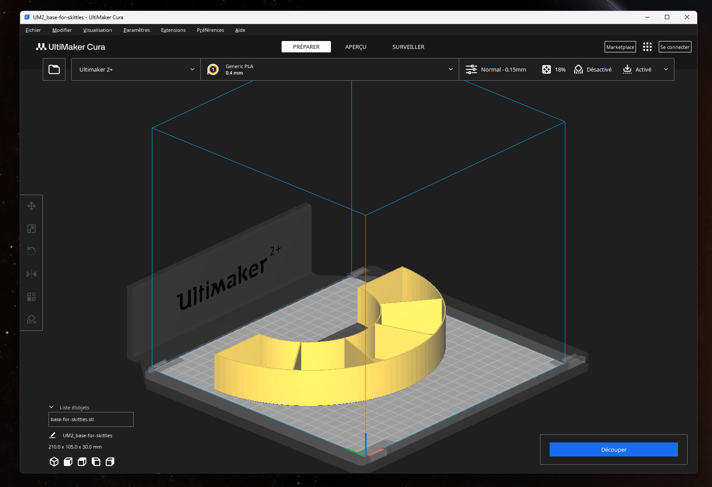

* **`supports-all.stl`**
  * **Description :** Fichier combiné des éléments de support.
  * **Rôle :** Regroupe plusieurs petites pièces de structure en un seul fichier d'impression pour permettre d'imprimer l'ensemble des fixations en un seul passage sur le plateau d'impression.

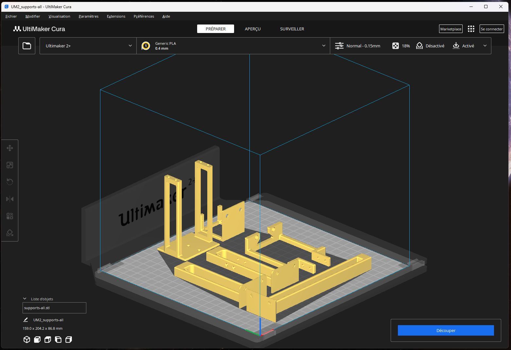

---

## Synthèse des composants requis pour le montage

| Composant Fonctionnel | Fichiers STL Associés |
| :--- | :--- |
| **Alimentation (Entonnoir)** | `feeder-main.stl`, `feeder-clamp.stl`, `support-feeder.stl` |
| **Distribution / Tri** | `main-disc.stl`, `turning-disc-servo.stl` |
| **Détection Couleur** | `support-sensor.stl`, `support-main-sensor.stl` |
| **Orientation & Chute** | `ramp-main.stl`, `ramp-adapt.stl` |
| **Moteurs & Structure** | `support-main.stl`, `support-servo.stl`, `support-main-servo.stl`, `base-for-skittles.stl` |